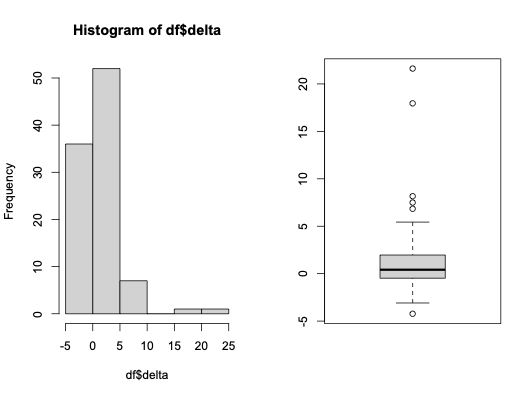

---
#### Exploring Changes in City-Level Murder Rates During the Ferguson Era: A Partial Identification Analysis

* Historical events: police killings of Michael Brown in August 2014 (Ferguson, MO) and Freddie Gray in April 2015 (Baltimore, MD)
* FBI Director James Comey and the "Ferguson effect": "Far more people are being killed in America’s cities this year than in many years." (October 23, 2015; [CNN Story](https://www.cnn.com/2015/10/26/politics/fbi-comey-crime-police)).
* Emphasis of this study: changes in murder rates at the city level, comparing 2013 to 2015
  
---
#### Prior Literature

* Pyrooz et al. (2016): examined changes in crime rates in large U.S. cities (105 cities with >200k population in 2010; compared 12 months before and after the Brown killing in Ferguson); no evidence of significant change.
* Rosenfeld (2015): distinguishes between 2 different Ferguson effects; studied 56 large American cities; 40 cities increased and 16 cities decreased from 2014-2015; considerable heterogeneity in city-specific trends.
* Rosenfeld and Wallman (2019); national study of the "spike" in murder rates from 2014-15; 53 large American cities studied from 2010-2015; effort to study the effect of arrest rates on murder rates.
* Gaston et al. (2019) studied homicide rates using CDC data from 2014-2016; goal was to determine whether police killings and civil unrest related to police killings and the opioid epidemic drove homicide rates higher in 586 urban American counties (population > 100k); found evidence in support of the Ferguson effect (particularly in the case of Black victim homicides).
* Important themes in the literature: missing data, strong identification assumptions, and ambiguity about the proper independent variable(s) to use.

---
#### Hypothesis

* Ferguson effect was originally described by Director Comey as a national phenomenon.
* A basic analysis could compare the murder rates in large American cities between 2013 (the year before Ferguson) and 2015 (the year after Ferguson).
* Let *p* be the probability that a city drawn at random experienced an increase in its murder rate from 2013 to 2015.
* Let $\Delta_i$ be the 2015 murder rate minus the 2013 murder rate for city *i*.
* Hypothesis 1: *p* > 0.5.
* Hypothesis 2: E(Δ) > 0
  
---
#### Dataset/Methods

* According to Pyrooz et al. (2016:7, Appendix A) there were 105 American cities with at least 200,000 population in the year 2010.
* We can use these same 105 cities.
* Number of murders is based on the FBI's Uniform Crime Reporting Program for the years 2013 and 2015.
* Population size is also based on each city's jurisdiction as reported in the UCR records for the years 2013, 2014, and 2015.
* The first version of the variables (h13-h15 and p13-p15) were obtained from the [published UCR reports](https://www.fbi.gov/how-we-can-help-you/more-fbi-services-and-information/ucr/publications); the second version of the variables (h13a-h15a and p13a-p15a) were obtained from Jacob Kaplan's [website](https://crimedatatool.com), which, itself, is based on data from the [Crime Data Explorer](https://cde.ucr.cjis.gov/LATEST/webapp/#/pages/home).
* Data set:

```Rout
               city h13     p13 h14     p14 h15     p15 h13a    p13a h14a    p14a h15a    p15a
1       albuquerque  37  558165  30  558874  43  559721   37  558165   30  558874   43  559721
2           anaheim  11  345320  14  346956  18  349471   11  345320   14  346956   18  349471
3         anchorage  14  299455  12  301306  26  301239   14  299455   12  301306   26  301239
4         arlington  18  378765  13  382976   8  387565   18  378765   13  382976    8  387565
5           atlanta  84  451020  93  454363  94  464710   83  451020   93  454363   94  464710
6            aurora  23  343484  11  350948  24  360237   20  343484    9  350948   25  360237
7            austin  26  859180  32  903924  23  938728   26  859180   32  903924   23  938728
8       bakersfield  24  361859  17  367406  22  373887   24  361859   17  367406   22  373887
9         baltimore 233  622671 211  623513 344  621252  233  622671  211  623513  344  621252
10       batonrouge  49  230212  53  229387  60  228727   49  230212   53  229387   60  228727
11       birmingham  63  212001  52  212115  79  212291   63  212001   52  212115   79  212291
12            boise   3  214330   4  216260   1  218844    3  214330    4  216260    1  218844
13           boston  39  643799  53  654413  38  665258   39  643799   53  654413   38  665258
14          buffalo  47  258789  60  258419  41  258096   47  258789   60  258419   41  258096
15       chandleraz   2  248718   1  252369   1  258875    2  248718    1  252369    1  258875
16        charlotte  59  837638  47  856916  61  877817   59  837638   47  856916   61  877817
17     chesapeakeva   9  230577  10  232489  11  235273    8  230577   10  232489   11  235273
18          chicago 414 2720554 411 2724121 478 2728695  416 2720554  415 2724121  481 2728695
19     chulavistaca   2  255073   7  259894   6  265215    2  255073    7  259894    6  265215
20       cincinnati  70  296491  60  297671  66  298478   70  296491   60  297671   67  298478
21        cleveland  55  389181  63  388655  NA      NA   58  389181   63  388655   78  387921
22  coloradosprings  26  436108  20  444949  25  452410   26  436108   20  444949   22  452410
23         columbus  NA      NA  83  830811  77  847745   78  816364   85  830811   83  847745
24    corpuschristi  18  314523  27  319211  17  324326   18  314523   27  319211   17  324326
25           dallas 143 1255015 116 1272396 136 1301977  143 1255015  116 1272396  136 1301977
26           denver  40  648981  31  665353  53  682418   41  648981   31  665353   53  682418
27        desmoines  11  207391   9  208250  19  210403   11  207391    9  208250   19  210403
28          detroit 316  699889 298  684694 295  673225  316  699889  298  684694  287  673225
29           durham  NA      NA  21  249738  34  257911   25  242865   21  249738   34  257911
30           elpaso  10  679700  21  680273  17  686077   10  679700   21  680273   17  686077
31      fortwaynein  31  254820  12  257172  25  259712   33  254820   12  257172   25  259712
32        fortworth  48  789035  NA      NA  55  829731   49  789035   53  804907   56  829731
33        fremontca   1  224475   1  227575   2  232427    1  224475    1  227575    2  232427
34         fresnoca  40  508876  47  513187  39  520837   40  508876   47  513187   39  520837
35        garlandtx   6  235683   5  236414   8  237593    6  235683    5  236414    8  237593
36        gilbertaz   1  225232   0  235430   2  247324    1  225232    0  235430    2  247324
37       glendaleaz  13  234006  NA      NA  13  240374   13  234006   20  236780   13  240374
38       greensboro  27  279343  23  282203  26  285950   27  279343   23  282203   26  285950
39      hendersonnv   8  268237   3  274121   4  282554    8  268237    3  274121    4  282554
40        hialeahfl  13  234182   6  235446   7  238132   13  234182    6  235446    7  238132
41         honolulu  NA      NA  NA      NA  15  999307   NA      NA    7  994034   15  999307
42          houston 214 2180606 242 2219933 303 2275221  214 2180606  242 2219933  303 2275221
43     indianapolis 129  850220 136  858238 148  863675  129  850220  136  858238  148  863675
44           irvine   2  235830   0  242971   2  258198    2  235830    0  242971    2  258198
45         irvingtx   2  228367   5  231708   9  236465    2  228367    5  231708    9  236465
46     jacksonville  93  845745  96  856021  97  867258   93  845745   96  856021   97  867258
47       jerseycity  20  256886  24  260005  27  265159   20  256886   24  260005   27  265159
48       kansascity  99  465514  78  468417 109  473373   99  465514   79  468417  110  473373
49         laredotx   3  247353  NA      NA   8  256280    3  247353   14  250994    8  256280
50         lasvegas  97 1500455 122 1530899 127 1562134   97 1500455  122 1530899  127 1562134
51      lexingtonky  18  308712  20  311848  15  314077   18  308712   20  311848   15  314077
52        lincolnne   5  267565   7  271208   1  276585    5  267565    7  271208    1  276585
53        longbeach  34  469665  23  471123  36  476318   34  469665   23  471123   36  476318
54       losangeles 251 3878725 260 3906772 282 3962726  251 3878725  260 3906772  282 3962726
55       louisville  48  671120  56  677710  81  680550   48  671120   56  677710   82  680550
56        lubbocktx   5  237875  12  241826  16  247271    5  237875   12  241826   16  247271
57          madison   5  242523   7  245788   7  248833    5  242523    5  245788    6  248833
58          memphis 124  657691 140  654922 135  657936  125  657691  139  654922  138  657936
59             mesa  22  456155  13  462092  16  471034   22  456155   13  462092   16  471034
60            miami  71  418394  81  421996  75  437969   71  418394   81  421996   75  437969
61        milwaukee 104  600805  90  600374 145  600400  104  600805   86  600374  146  600400
62      minneapolis  36  396206  31  404461  47  413479   36  396206   31  404461   47  413479
63          modesto  14  204252  11  205820  25  210794   14  204252   11  205820   25  210794
64        nashville  35  635673  41  647689  72  658029   35  635673   42  647689   79  658029
65       neworleans 156  377022 150  387113 164  393447  156  377022  150  387113  164  393447
66          newyork 335 8396126 333 8473938 352 8550861  335 8396126  333 8473938  352 8550861
67           newark 112  278246  93  279110  NA      NA  112  278246   94  279110   NA      NA
68          norfolk  28  247303  31  247078  28  245400   29  247303   31  247078   28  245400
69    northlasvegas   7  225632  12  229436  14  234386    7  225632   12  229436   14  234386
70          oakland  90  403887  80  409994  85  419481   90  403887   80  409994   85  419481
71     oklahomacity  62  605034  45  617975  73  630621   62  605034   45  617975   73  630621
72            omaha  42  425076  32  438465  48  452252   42  425076   32  438465   48  452252
73          orlando  17  253238  15  259675  32  268438   17  253238   15  259675   32  268438
74     philadelphia 247 1553153 248 1559062 280 1567810  247 1553153  248 1559062  280 1567810
75          phoenix 118 1502139 114 1529852 112 1559744  118 1502139  114 1529852  112 1559744
76       pittsburgh  45  307632  69  307613  57  306870   45  307632   69  307613   57  306870
77          planotx   3  275795   4  277822   4  282968    3  275795    4  277822    4  282968
78         portland  14  609136  26  615672  NA      NA   14  609136   26  615672   NA      NA
79          raleigh  12  428993  NA      NA  NA      NA   12  428993   NA      NA   NA      NA
80             reno  14  232561  15  235055  15  239721   14  232561   15  235055   15  239721
81         richmond  37  212830  41  216747  43  220802   37  212830   43  216747   43  220802
82      riversideca  10  316423  12  319453  10  323064   10  316423   12  319453   10  323064
83        rochester  42  210562  27  210347  33  209922   42  210562   32  210347   33  209922
84       sacramento  34  478182  28  482767  43  489717   34  478182   28  482767   43  489717
85       sanantonio  72 1399725 103 1428465  94 1463586   72 1399725  103 1428465   94 1463586
86    sanbernardino  45  214322  43  214588  44  216477   45  214322   43  214588   44  216477
87         sandiego  39 1349306  32 1368690  37 1400467   39 1349306   32 1368690   37 1400467
88     sanfrancisco  48  833863  45  850294  53  863782   48  833863   45  850294   53  863782
89          sanjose  38  992143  32 1009679  30 1031458   38  992143   32 1009679   30 1031458
90         santaana  13  332848  18  336462  12  337304   13  332848   18  336462   12  337304
91       scottsdale   4  225523  NA      NA   6  233872    4  225523    2  229325    6  233872
92          seattle  19  642814  26  663410  23  683700   18  642814   26  663410   24  683700
93          spokane  11  209524  10  211025  12  212698   11  209524   10  211025   12  212698
94          stlouis 120  318563 159  318574 188  317095  120  318563  159  318574  188  317095
95           stpaul  14  294690  11  297984  16  300721   14  294690   11  297984   16  300721
96     stpetersburg  15  247084  19  250772  14  255821   15  247084   19  250772   14  255821
97         stockton  32  299796  49  299519  49  304890   32  299796   49  299519   49  304890
98            tampa  28  351314  28  357124  34  364383   28  351314   28  357124   34  364383
99           toledo  28  283035  24  281150  24  279552   28  283035   24  281150   24  279552
100          tucson  47  525486  NA      NA  31  529675   47  525486   35  527328   31  529675
101           tulsa  60  394498  46  399556  55  401520   60  394498   46  399556   55  401520
102   virginiabeach  17  450687  17  451102  19  452797   17  450687   17  451102   19  452797
103    washingtondc 103  646449 105  658893 162  672228  103  646449  105  658893  162  672228
104         wichita  15  386486  NA      NA  27  389824   15  386486   21  387493   27  389824
105    winstonsalem  15  235811  13  238082  NA      NA   15  235811   13  238082   10  241631
```

* Next, we calculate the murder rates for each of the 105 cities for the years 2013 (the year before the events in Ferguson) and 2015 (the year after the events in Ferguson) based on the UCR published reports. For this analysis, we will rely on the murder rate based on the 2013 population size for each year:
  
```R
df$r13 <- (df$h13/df$p13)*100000
df$r15 <- (df$h15/df$p15)*100000
df$delta <- df$r15-df$r13
table(df$delta,exclude=NULL)
```

* Here is our output:

```Rout
> df$r13 <- (df$h13/df$p13)*100000
> df$r15 <- (df$h15/df$p15)*100000
> df$delta <- df$r15-df$r13
> table(df$delta,exclude=NULL)

   -4.2264944303562   -3.09145577990332   -2.68811715695588 
                  1                   1                   1 
  -2.61169179198061   -2.53940280770674   -2.27595185869848 
                  1                   1                   1 
  -2.02032578975854   -1.56677857332485   -1.51125478314244 
                  1                   1                   1 
  -1.50715229423988   -1.49730314435406   -1.42613963520725 
                  1                   1                   1 
  -1.33108538180323   -1.30760461031011   -1.05477823219939 
                  1                   1                   1 
 -0.948633090260879  -0.942764225746169  -0.921588768430544 
                  1                   1                   1 
 -0.748286832337622  -0.674799228783991  -0.670959677551942 
                  1                   1                   1 
 -0.598233398869121  -0.576017206824496  -0.573037945591837 
                  1                   1                   1 
 -0.481312313727147  -0.435865005102178    -0.4178367275792 
                  1                   1                   1 
 -0.372513809796698  -0.348065068440382  -0.345721726210054 
                  1                   1                   1 
 -0.248398900418235  -0.147174281238943 -0.0945589196443386 
                  1                   1                   1 
-0.0734691854445692 -0.0649646152220726 -0.0338099823705811 
                  1                   1                   1 
 0.0877996685620186   0.126609162789111   0.154849062796409 
                  1                   1                   1 
  0.188454036054615   0.237348126208547   0.305973833443694 
                  1                   1                   1 
  0.318773563805586    0.32582293937407   0.364669207360681 
                  1                   1                   1 
  0.379466144881643   0.391806764279037   0.408294639824376 
                  1                   1                   1 
  0.415001320725991   0.424121713634324   0.545274015340295 
                  1                   1                   1 
  0.569791256379789   0.645114711905089   0.732965676737821 
                  1                   1                   1 
  0.751471567565807   0.772168210487582   0.791850902535721 
                  1                   1                   1 
  0.821310124610802    1.00661867351688    1.05353468472026 
                  1                   1                   1 
   1.27871370365836    1.32853306639213    1.36076339995745 
                  1                   1                   1 
   1.47822621917223    1.60299224469485    1.60321762490958 
                  1                   1                   1 
   1.66487440956126    1.66519864285879    1.67031798167725 
                  1                   1                   1 
   1.75942460365421    1.90874419906274    1.95617311257009 
                  1                   1                   1 
   1.96353191440305    1.96519079457117    2.08969409697631 
                  1                   1                   1 
   2.28077936414219    2.30004248322125    2.39701502161764 
                  1                   1                   1 
    2.8706561749003    2.93027681479006    3.04507882754164 
                  1                   1                   1 
   3.50360192048708    3.72629847992384    3.94677366539968 
                  1                   1                   1 
    3.9558606780171     4.3686891360957    4.74991482727428 
                  1                   1                   1 
   4.94741688718449    5.00564206289317    5.20776343639668 
                  1                   1                   1 
   5.39744506667302    5.43579144757499    6.84045735196462 
                  1                   1                   1 
   7.49622977951065    8.16576828892071    17.9526153397927 
                  1                   1                   1 
    21.619067863058                <NA> 
                  1                   8 
> 
```

#### Missing-at-Random Analysis of p(increase)

* These results tell us that 61 of the 105 cities experienced an increase from 2013 to 2015; for 8 cities, we are not able to tell whether there was an increase or a decrease because some of the data were missing.
* Analysis objective #1: develop a valid estimate of θ (the probability that a city experienced an increase in its murder rate from 2013 to 2015).
* estimate θ = p(observed)*p(increase|observed)+p(missing)*p(increase|missing)
* if p(missing) > 0, we can obtain the missing-at-random estimate of θ by assuming that θ|missing = θ|observed.
* In addition to θ, we will calculate a 95% confidence interval for θ.
* Will use the Clopper-Pearson (exact) procedure to calculate the confidence interval.

```R
t <- table(df$delta>0,exclude=NULL)
t

t[2]/(t[1]+t[2])
qbeta(p=0.025,shape1=t[2],shape2=1+t[1])
qbeta(p=0.975,shape1=1+t[2],shape2=t[1])
```

which gives the output:

```Rout
> t <- table(df$delta>0,exclude=NULL)
> t

FALSE  TRUE  <NA> 
   36    61     8 
> 
> t[2]/(t[1]+t[2])
    TRUE 
0.628866 
> qbeta(p=0.025,shape1=t[2],shape2=1+t[1])
[1] 0.5248197
> qbeta(p=0.975,shape1=1+t[2],shape2=t[1])
[1] 0.7248168
```

* We can reject Ho that θ = 0.5, because the confidence interval for θ does not include 0.5.

#### Missing-at-Random Analysis of Change Scores

* The first analysis provides a sense of the direction of change but doesn't tell us anything about the typical magnitude of change.
* Let each city be characterized by its change score, Δ = 2015 murder rate minus the 2013 murder rate.
* Then, we consider measures of central tendency or typicality in the observed change scores (i.e., the mean and median of the change scores).
* What can the data tell us about these quantities?
* Let's begin with a histogram and boxplot:

<p align="center">

</p>

* E(Δ) = p(observed)*E(Δ|observed)+p(missing)*E(Δ|missing)
* if p(missing) > 0, we can obtain the missing-at-random estimate of E(Δ) by assuming that E(Δ|missing) = E(Δ|observed)
* for the missing-at-random estimate of the median(Δ), we also assume that median(Δ|missing) = median(Δ|observed)
* we can use standard tools to calculate the confidence interval for each estimate
* next, we calculate E(Δ|observed):

```R
mean(df$delta,na.rm=T)
t.test(df$delta,conf.level=0.95,na.rm=T)
```

```Rout
> mean(df$delta,na.rm=T)
[1] 1.287467
> t.test(df$delta,conf.level=0.95,na.rm=T)

	One Sample t-test

data:  df$delta
t = 3.5781, df = 96, p-value = 0.0005447
alternative hypothesis: true mean is not equal to 0
95 percent confidence interval:
 0.5732277 2.0017068
sample estimates:
mean of x 
 1.287467 
>
```

* since the 95% confidence interval for E(Δ|observed) does not include zero, we reject Ho that E(Δ|observed) = 0.
* then, we consider median(Δ|observed):

```R
median(df$delta,na.rm=T)
library(DescTools)
MedianCI(df$delta,conf.level=0.95,method="boot",type="bca",na.rm=T)
```

```Rout
> median(df$delta,na.rm=T)
[1] 0.4150013
> library(DescTools)
> MedianCI(df$delta,conf.level=0.95,method="boot",type="bca",na.rm=T)
   median    lwr.ci    upr.ci 
0.4150013 0.1266092 0.8213101 
>
```
* again, since the 95% confidence interval for median(Δ|observed) does not include zero, we reject Ho that median(Δ|observed) = 0.

---
#### Bounds Analysis for θ

* minimum value of θ consistent with the data: 97/105 x 61/97 + 8/105 x 0/8 = 0.581
* maximum value of θ consistent with the data: 97/105 x 61/97 + 8/105 x 8/8 = 0.657
* notice that 0.657-0.581 = 0.076 which is the same as 8/105 (fraction of cases that are missing)
* Bonferroni-corrected 95% confidence interval for the lower and upper bounds: LB: [0.467,0.689] and UB: [0.544,0.758]
* the dominant sign of change is identified (more than 1/2 of the cities experienced an increase even if none of the missing cities experiencecd an increase but the Bonferroni-corrected 95% confidence interval for the lower bound estimate of θ now includes 1/2.

```R
lb <- 97/105*61/97+8/105*0/8
lb
ub <- 97/105*61/97+8/105*8/8
ub
ub-lb
8/105

# B-corrected confidence interval for lower bound
qbeta(p=0.0125,shape1=61,shape2=1+36+8)
qbeta(p=0.9875,shape1=1+61,shape2=36+8)

# B-corrected confidence interval for upper bound
qbeta(p=0.0125,shape1=61+8,shape2=1+36)
qbeta(p=0.9875,shape1=1+61+8,shape2=36)
```

```Rout
> lb <- 97/105*61/97+8/105*0/8
> lb
[1] 0.5809524
> ub <- 97/105*61/97+8/105*8/8
> ub
[1] 0.6571429
> ub-lb
[1] 0.07619048
> 8/105
[1] 0.07619048
> 
> # B-corrected confidence interval for lower bound
> qbeta(p=0.0125,shape1=61,shape2=1+44)
[1] 0.4669867
> qbeta(p=0.9875,shape1=1+61,shape2=44)
[1] 0.6890145
> 
> # B-corrected confidence interval for upper bound
> qbeta(p=0.0125,shape1=61+8,shape2=1+36)
[1] 0.5443668
> qbeta(p=0.9875,shape1=1+61+8,shape2=36)
[1] 0.7584362
>
```

#### Bounds Analysis for median(Δ)

* Previously, we studied the missing-at-random estimates of E(Δ|observed) and median(Δ|observed)
* It is not possible to place meaningful bounds on E(Δ) because there are no limits on the set of values that E(Δ|missing) could take on.
* It is possible to place meaningful bounds on median(Δ) by setting the missing values of Δ to a low value (to get the lower bound) and a high value (to get the upper bound).
* We will use the minimum and maximum values in the set of observed Δs to derive the bounds, [-4.227,21.620].
* Then, we calculate Bonferroni-corrected confidence intervals for each bound:

```R
min(df$delta,na.rm=T)
max(df$delta,na.rm=T)

# lower bound of the median

delta.min <- df$delta
delta.min[is.na(df$delta)] <- -4.227
median(delta.min)
MedianCI(delta.min,conf.level=0.975,method="boot",type="bca")

# upper bound of the median

delta.max <- df$delta
delta.max[is.na(df$delta)] <- 21.620
median(delta.max)
MedianCI(delta.max,conf.level=0.975,method="boot",type="bca")
```

```Rout
> min(df$delta,na.rm=T)
[1] -4.226494
> max(df$delta,na.rm=T)
[1] 21.61907
> 
> # lower bound of the median
> 
> delta.min <- df$delta
> delta.min[is.na(df$delta)] <- -4.227
> median(delta.min)
[1] 0.3646692
> MedianCI(delta.min,conf.level=0.975,method="boot",type="bca")
    median     lwr.ci     upr.ci 
 0.3646692 -0.1471743  0.7514716 
> 
> # upper bound of the median
> 
> delta.max <- df$delta
> delta.max[is.na(df$delta)] <- 21.620
> median(delta.max)
[1] 0.6451147
> MedianCI(delta.max,conf.level=0.975,method="boot",type="bca")
   median    lwr.ci    upr.ci 
0.6451147 0.2373481 1.3607634 
>
```

* So, the bounds on the median change score are [+0.365,+0.645].
* The B-corrected 95% confidence intervals on the lower and upper bounds respectively are [-0.147,+0.751] and [+0.237,+1.361].
* So, the sign of the median change score is identified.
* But the confidence limits on the lower bound estimate include zero.
* And the evidence is, therefore, not strong enough to reject Ho that median(Δ) is equal to zero.
* Remember that insufficient evidence to reject Ho is not evidence that Ho is correct!

---
#### Conclusions

* Murder is among the best measured crimes in the United States (and Teddy's point that our tools for studying patterns and trends are more powerful than ever).
* Yet, our measures of murder are not without problems.
* One issue is that our principal law enforcement-based measure of murder (the UCR) is based on voluntary participation by agencies.
* Each year, some agencies across the United States are not represented in the nation's crime statistics.
* When we compare crime statistics in different years, the problem is compounded.
* One solution to this problem is to assume that the patterns among the observed agencies are replicated among the missing agencies.
* We call this the missing-at-random (MAR) assumption.
* Advantage of MAR: we can get a point estimate with a confidence interval.
* Disadvantage of MAR: we can't test the assumption.
* Consequence of relying on it: we understate the uncertainty of our analysis.
* A standard MAR analysis would lead us to reject the hypothesis that θ = 0.5 (a city drawn at random is equally likely to have experienced an increase or a decrease in its murder rate from 2013 to 2015).
* A partial identification analysis leads us to the conclusion that our sample *p* must be somewhere between 0.561 and 0.646.
* The confidence interval around the lower bound estimate of θ = 0.561 is [0.438,0.679]; since this confidence interval includes 0.5, we now fail to reject the hypothesis that θ = 0.5.
* The data are simply not strong enough for us to infer whether θ is greater than 0.5.
